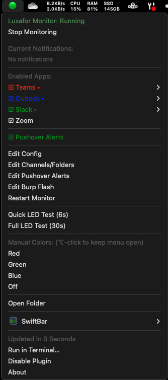

# Luxafor macOS Notification Monitor

Automatically monitor Slack, Teams, Zoom, Outlook and other apps for notifications and display them on your Luxafor LED device.


## Features

- 🚦 **Automatic LED Control** - Changes Luxafor color based on app notifications
- 📱 **Multi-App Support** - Monitor Slack, Teams, Zoom, Outlook, and more
- 🎨 **Customizable Colors** - Assign any color to any app via config file
- 📊 **Priority System** - Shows highest priority notification when multiple exist
- 🖥️ **Menu Bar Control** - Start/stop monitoring and see notification counts
- 📁 **Outlook Folder Monitoring** - Special colors/flash for specific email folders
- 🔔 **Individual App Toggle** - Enable/disable notifications per app
- 🚨 **Flash Alerts** - Configure flashing for urgent folders
- 🟠 **Device Status** - Amber icon when Luxafor disconnected
- 🚀 **App Launch Effects** - Flash on Burp Suite or other app launches
- ⚡ **Lightweight** - Near-zero CPU usage, no logging overhead
- 🔧 **Easy Configuration** - Simple text config files, no coding required

## SwiftBar Menu



The SwiftBar menu provides complete control over the Luxafor monitor:
- View current notification counts for all monitored apps
- Enable/disable notifications for individual apps with checkboxes
- Edit main config, Outlook folders, and Burp flash settings
- Quick LED tests (6s and 30s options)
- Manual color controls (hold ⌥ to keep menu open)
- Device connection status indicator (green/amber/red icon)
- One-click restart and folder access

## Quick Start

```bash
# Clone the repository
git clone https://github.com/LCraddock/luxafor-macos-monitor.git
cd luxafor-macos-monitor

# Run the installer
./install.sh
```

That's it! The monitor is now running and will start automatically on login.

### What the installer does:
- Installs dependencies (SwiftBar, hidapi, cmake)
- Clones and builds the enhanced luxafor-cli from source
- Sets up the monitor service and menu bar integration
- Creates default configuration in `~/.luxafor-monitor/`

## How It Works

1. Polls notification badges using macOS `lsappinfo` every 5 seconds
2. For Outlook, also checks all folders (not just inbox)
3. Sets Luxafor to the color of the highest priority app with notifications
4. Menu bar icon shows status (🟢 running / 🔴 stopped)

## Configuration

### Main Configuration

Edit `~/.luxafor-monitor/luxafor-config.conf` to customize:

```bash
# Format: AppName|BundleID|Color|Priority
Teams|com.microsoft.teams2|red|1
Outlook|com.microsoft.Outlook|blue|2
Slack|com.tinyspeck.slackmacgap|green|3
Zoom|us.zoom.xos|magenta|4
```

After editing, restart via the menu bar or run:
```bash
~/.luxafor-monitor/luxafor-control.sh restart
```

### Finding Bundle IDs

To monitor additional apps:
```bash
lsappinfo list | grep -i "app name"
```

### Available Colors

Basic: `red`, `green`, `blue`, `yellow`, `magenta`, `cyan`, `orange`, `purple`, `pink`, `white`, `off`

Hex: `0xFF00FF` or `#FF00FF`

### Channel-Specific Monitoring

Configure specific channels and folders for granular notification control. Edit `luxafor-channels.conf`:

```bash
# Format: AppName|Type|Name|Color|Action|PushoverPriority|PushoverSound|Enabled
# Action can be: solid (default) or flash
# PushoverSound: pushover, bike, bugle, cashregister, classical, cosmic, falling, gamelan, incoming, intermission, magic, mechanical, pianobar, siren, spacealarm, tugboat, alien, climb, persistent, echo, updown, vibrate, none

# Outlook Folders
Outlook|folder|Phishing|yellow|flash|1|siren|false
Outlook|folder|Inbox|blue|solid|0|pushover|true
Outlook|folder|VIP|cyan|solid|1|tugboat|false

# Future: Teams/Slack channels can be added here
```

**Important Behavior Change**: 
- Outlook ONLY alerts on explicitly configured folders listed above
- There is no "all folders" monitoring - only folders in the channels config will trigger notifications
- Each folder can be individually enabled/disabled via the SwiftBar menu
- Each folder has its own color, flash mode, and Pushover settings

When emails appear in enabled folders:
- The Luxafor will use the folder's specific color
- If action is "flash", the LED will flash continuously
- Pushover alerts use the folder's specific priority and sound
- Disabled folders will NOT trigger any notifications

## Requirements

- macOS 10.15 or later
- Luxafor USB device
- Apps must have "Badge app icon" enabled in System Settings → Notifications

## Menu Bar Features

Click the 🟢/🔴 icon to:
- View current notification counts
- Start/Stop monitoring
- Edit configuration
- Run LED tests
- Set manual colors

## Command Line Usage

```bash
# Control the monitor
~/.luxafor-monitor/luxafor-control.sh start|stop|restart|status

# Run LED test
~/.luxafor-monitor/luxafor-test.sh

# Manual color control
~/.luxafor-monitor/luxafor-cli/build/luxafor red
```

## Uninstall

```bash
cd luxafor-macos-monitor
./uninstall.sh
```

## Troubleshooting

**Luxafor not lighting up?**
- Check if monitoring is running (menu bar should show 🟢)
- Ensure apps have badge notifications enabled in System Settings
- Test LED directly: `~/.luxafor-monitor/luxafor-cli/build/luxafor red`

**Apps not detected?**
- Apps must be in the Dock
- For Teams: @mention yourself in a channel
- For Slack: Use `/remind me test in 1 minute`

## Dependencies

This project uses:
- [Enhanced luxafor-cli](https://github.com/LCraddock/luxafor-cli) - Fork of [Mike Rogers' luxafor-cli](https://github.com/mike-rogers/luxafor-cli) with added color and effect support
- [SwiftBar](https://github.com/swiftbar/SwiftBar) - For menu bar functionality

The installer automatically builds the enhanced luxafor-cli from source, so you don't need to install it separately.

## License

MIT License - See LICENSE file for details

## Contributing

Pull requests welcome! Please test changes with your Luxafor device before submitting.

### Development Setup

1. Fork and clone the repository
2. Make your changes
3. Test with `./install.sh` (it will update existing installation)
4. Submit a pull request

### Note on File Paths

This repository contains full absolute paths (e.g., `/Users/larry.craddock/Projects/luxafor/`) rather than using `$HOME` or relative paths. This is intentional because:

- **plist files** (Launch Agents) require absolute paths and don't expand environment variables
- **AppleScript** doesn't understand shell variables like `$HOME`
- **SwiftBar** menu actions need absolute paths in their parameters

The installer script (`install.sh`) automatically updates all paths to match your system during installation, so these hardcoded paths won't affect end users.

## TODO

- [ ] Support for multiple Luxafor devices
- [ ] Different effects for different priority levels
- [ ] DND mode scheduling
- [ ] Support for Luxafor Flag vs Orb differences